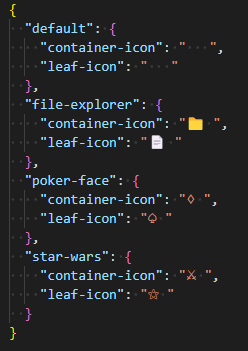

# Funny JSON Explorer

## 简介

SYSU《软件工程》课程作业，要求实现 JSON 文件可视化，并使用工厂方法（Factory）、抽象工厂（Abstract Factory）、建造者（Builder）模式、组合模式（Composition）等设计模式组织代码。

## 编译

```shell
go build .
```

## 使用

```shell
.\FJE.exe -f <json file> -s <style> -i <icon family>
```

目前支持的可视化风格有：树形 (tree)、矩形 (rectangle)，可通过在 FJE/symbol 包中添加具体工厂，在 FJE/sytle 包中添加具体生成器拓展风格。

目前支持的图标族有：



可通过修改 icon_family.json 文件拓展图标族。

json_example 文件夹中有可用于测试的 JSON 文件。

